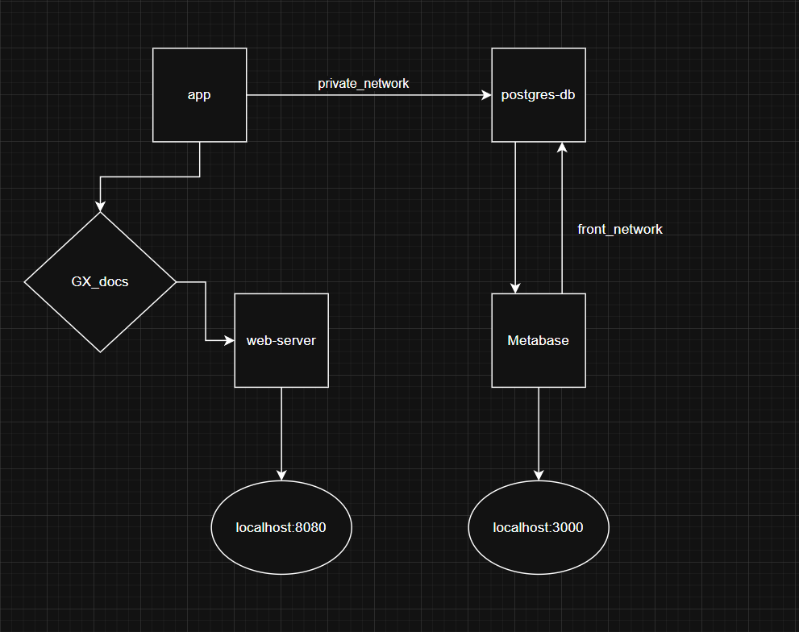
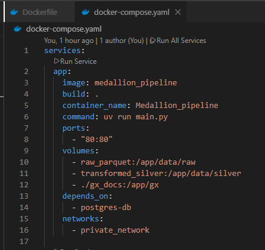
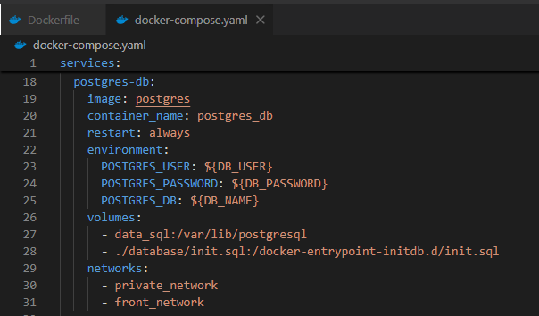
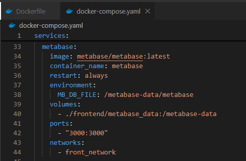
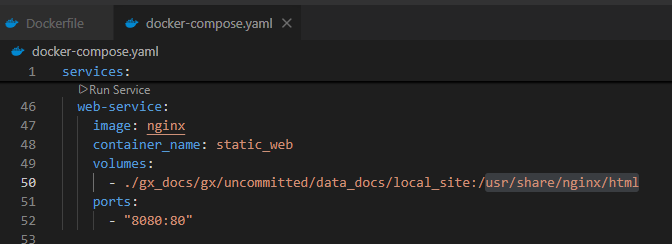
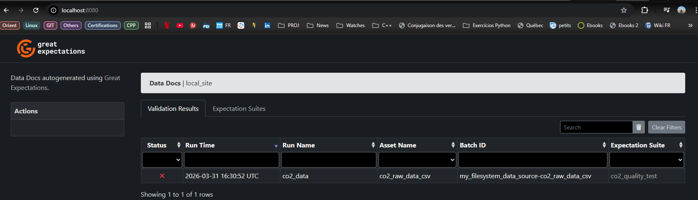
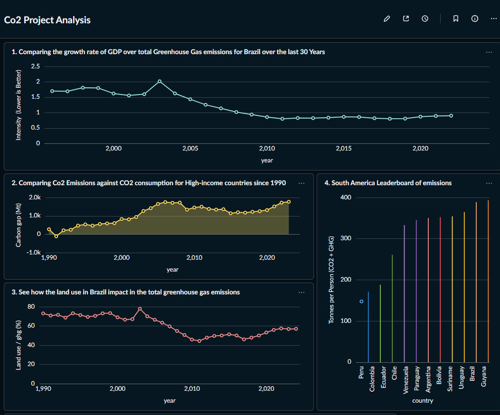

# 1. Arquitetura do Projeto

O fluxo de dados segue uma arquitetura "Medallion" simplificada:

1. **Fonte - Bronze:** Dados brutos em CSV (~60k linhas x 80 colunas - 4M dados)
2. **Processamento - Silver - (Python):** Limpeza, tipagem e transformação utilizando `Pandas`.
3. **Storage Intermediário - Silver - (Parquet):** Escrita em formato colunar para eficiência de I/O.
4. **Destino - Silver - (Postgres):** Carga final no PostgreSQL estruturada em Star Schema.
5. **Tratamento do dado transformado - GOLD:** Aplicação das regras de negócio aos dados transformados.
6. **Query e visualização dos dados - GOLD - (Metabase):** Análise dos dados via queries.

# 2. Documentação do Projeto 

Todas as dependências são gerenciadas pelo ambiente virtual uv e arquivo `pyproject.toml`.
Todos os elementos do projeto são criados em docker containers e integrados via docker-compose.

## Infraestrutura do Projeto - Criação dos Docker containers (via Docker-compose)
> **Imagem 1: Integração entre os services**

O projeto possui 4 serviços definidos no arquivo `docker-compose.yaml`. Eles são:

### 1. app:
Define o Container `Medallion_pipeline`, onde a Pipeline do projeto irá rodar. Contém os scripts .py do projeto. Este serviço depende do serviço `postgres-db`.
No momento da geração do serviço, 4 ações importantes ocorrem:
- Execução do script `main.py` através do ambiente uv.
- Criação de 3 volumes internos:
    1. Volume `raw_parquet` para persistir os dados da camada Bronze, pós extração (dados brutos).
    2. Volume `transformed_silver` para persistir os dados da camada Silver, pós transformação dos dados.
    3. Volume `gx_docs` montado ao diretório local para persistir os dados gerados pela ferramenta __great_expectations__.
> **Imagem 2: app service**

 
### 2. postgres-db:
Define o Container `postgres_db`, onde uma imagem do banco de dados __PostgreSQL__ será criada. Toda a interação com o banco de dados PostgreSQL (criação de tabelas, queries, etc), será feita dentro desse container.
O serviço `postgres-db` se conecta ao serviço `app` através de uma rede __private_network__ definida no próprio arquivo docker-compose.
No momento da geração do serviço, 3 ações importantes ocorrem:
- variáveis de ambiente são usadas para fornecer as informações necessárias para a criação do banco PostgreSQL.
- O volume interno data_sql é criado para persistir os dados do banco.
- O arquivo `init.sql` é executado para criar as tabelas do projeto, com os respectivos dicionários de dados. 
> **Imagem 3: postgres-db service**

### 3. metabase:
Define o Container `metabase`, onde a imagem da ferramenta de BI __Metabase__ será criada. 
Esse container possibilitará, através de uma conexão __localhost__, acesso a uma User Interface (UI) para visualização do Dashboard do projeto e  execução de outras queries, que possam ser do interesse do usuário.
O serviço `metabase` se conecta ao serviço `postgres-db` através de uma rede __front_network__ definida no próprio arquivo docker-compose.
No momento da geração do serviço, 2 ações importantes ocorrem:
- O local do Container onde os arquivos são salvos é mapeado para o local `./frontend/metabase_data` para serem persistidos.
- A porta `3000` é exposta para ser acessada via localhost.
> **Imagem 4: metabase service**

### 4. web-service:
Define o Container `static_web`, onde a imagem do servidor-web __nginx__ será criada.
O Container desse serviço se conecta ao mesmo volume `gx_docs`, gerado pelo serviço `app`, para servir o report de validação dos dados da camada Bronze via web, estaticamente.
No momento da geração do serviço, 2 ações importantes ocorrem:
- Arquivo .html presente no diretório local `gx_docs/gx/uncommitted/data_docs/local_site` é montado para o diretório `/usr/share/nginx/html` do Container para ser servido via web.
- A porta `80` do Container __nginx__ é mapeada para a porta local `8080`, onde é exposta para ser acessada via localhost.
> **Imagem 5: web-service service**

Finalmente, a pipeline do projeto foi dividida em etapas modulares para garantir a escalabilidade.
Essas etapas são: 

### ETAPA A: Ingestão (Python)
Os dados brutos foram extraídos do site: _https://github.com/owid/co2-data_.
E foram consequentemente armazenados no diretório `/app/data/raw` do Container, como explicado acima, e consequentemente mapeado para o volume interno `raw_parquet` para persistência.

### ETAPA A.1: Validação dos Dados (Great-expectations)
Antes de seguir para a camada Silver, os dados são validados usando a biblioteca Great Expectations. 
Os dados são então persistidos e depois servidos usando o Container `web-service`.
> **Imagem 6: web-service - Great Expectations - Data Docs**

### ETAPA B: Transformação (Python)
Os dados são carregados a partir do diretório `/app/data/raw`.
Uma série de transformações é realizada nesses dados, garantindo que a camada Silver seja imutável e performática.
Os dados são então salvos em formato `.parquet` no diretório `app/data/silver` do mesmo container e mapeado para o volume interno `transformed_silver` para persistência.

### ETAPA C: Carga no PostgreSQL (SQLAlchemy)
Aplica-se, inicialmente, as regras de negócio às tabelas geradas na camada silver.
Em seguida, a pipeline se conecta ao Container `postgres_db` e envia as tabelas para o Banco de dados __PostgreSQL__.

### ETAPA D: Análise e Visualização (metabase)
Em seguida o Container `metabase` se conecta diretamente ao Container `postgres_db`, permitindo acessar os dados de forma interativa.  
A partir das tabelas do PostgreSQL, 7 queries de negócio são executadas e um dashboard é criado.
> **Imagem 7: Dashboard**

# 3. Instruções de Execução
Este projeto é totalmente containerizado e não requer instalação de dependências Python locais.
Antes de executar o projeto, crie um arquivo `.env` na raiz do repositório a partir do arquivo `.env.example`.

Ou apenas execute no terminal:
`cp .env.example .env`

Opcionalmente, edite as variáveis de ambiente com suas próprias credenciais. Caso não sejam alteradas, os valores padrão já permitem a execução completa do projeto.

Pré-requisitos:
- Docker
- Docker Compose

Para reproduzir todo o ambiente, abra o terminal e execute apenas:
`docker compose up -d --build`

Este comando irá:
- Construir a imagem docker da aplicação;
- Subir os containers (Postgres, Metabase, Web e App);
- Executar o pipeline ETL;
- Executar as validações do Great Expectations;
- Gerar a documentação HTML de qualidade de dados; 
- Disponibilizar o Dashboard de BI.

Após a execução, acesse:

Great Expectations Data Docs:
http://localhost:8080

Metabase (BI):
http://localhost:3000
- Ao entrar na UI do Metabase, procure pelo Dashboard em: `COLLECTIONS -> Shared Collections -> Project Dashboards -> Co2 Project Analysis`

- Após finalizar com o projeto execute no terminal:
`docker compose down`

Este comando irá:
- Remover os containers criados.